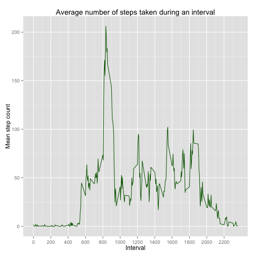

## Loading and preprocessing the data

1. Load the data


```r
data <- read.csv('activity.csv')
```

2. Process/transform the data (if necessary) into a format suitable for your analysis

For the first part, I have not used any transformation.  However, there are NA values for the steps column. In the first part of the assignment, I've ignored them to have meaningful results. In the second part of the assignment, they will be replaced via simulated values.

## What is mean total number of steps taken per day?

1. Calculate the total number of steps taken per day

To do this, I've used the dplyr package. First, I filter out the NA values in the steps column. Then I've grouped by date. Finally I've added three extra columns in the new data frame. These denote sum of steps taken each day, mean of the taken steps and median of the taken steps respectively. By doing this. I've also completed most of the work to be done in step 3.


```r
# Loading order of these packages create a problem while knitting the HTML file. Since
# both are used, plyr is loaded here.
library(plyr)
library(dplyr)

data_grouped_by_date <- subset(data, !is.na(data$steps)) %>%
    group_by(date) %>%
    summarise(sum_steps = sum(steps),
              mean_step_count = mean(steps),
              median_step_count = median(steps)) %>%
  arrange(date)
```

2. Make a histogram of the total number of steps taken each day


```r
library(ggplot2)

ggplot(aes(x = sum_steps), data = data_grouped_by_date) +
  xlab('Number of steps') +
  ylab('Count') +
  ggtitle('Number of taken steps per day') +
  geom_histogram(colour = "darkgreen", fill = "white")
```

```
## stat_bin: binwidth defaulted to range/30. Use 'binwidth = x' to adjust this.
```

 

3. Calculate and report the mean and median of the total number of steps taken per day

Since calculation is already done in step 1 of this subtask, I've only displayed the results.


```r
data_grouped_by_date
```

```
## Source: local data frame [53 x 4]
## 
##          date sum_steps mean_step_count median_step_count
## 1  2012-10-02       126         0.43750                 0
## 2  2012-10-03     11352        39.41667                 0
## 3  2012-10-04     12116        42.06944                 0
## 4  2012-10-05     13294        46.15972                 0
## 5  2012-10-06     15420        53.54167                 0
## 6  2012-10-07     11015        38.24653                 0
## 7  2012-10-09     12811        44.48264                 0
## 8  2012-10-10      9900        34.37500                 0
## 9  2012-10-11     10304        35.77778                 0
## 10 2012-10-12     17382        60.35417                 0
## ..        ...       ...             ...               ...
```

## What is the average daily activity pattern?

1. Make a time series plot (i.e. type = "l") of the 5-minute interval (x-axis) and the average number of steps taken, averaged across all days (y-axis)


```r
data_grouped_by_interval <- subset(data, !is.na(data$steps)) %>%
    group_by(interval) %>%
    summarise(sum_steps = sum(steps),
              mean_step_count = mean(steps),
              median_step_count = median(steps))

# Create a time series plot using ggplot2
ggplot(data = data_grouped_by_interval, aes(interval, mean_step_count)) + 
  xlab('Interval') +
  ylab('Mean step count') +
  geom_line(color = 'darkgreen') +
  ggtitle('Average number of steps taken during an interval') +
  scale_x_continuous(breaks = seq(min(data_grouped_by_interval$interval),
                                        max(data_grouped_by_interval$interval), 
                                        by = 200))
```

 

2. Which 5-minute interval, on average across all the days in the dataset, contains the maximum number of steps?

Interval 835 contains maximum average number of steps.

## Imputing missing values

1. Calculate and report the total number of missing values in the dataset (i.e. the total number of rows with NAs)

There are no missing values for the interval and date columns according to the following code:


```r
any(is.na(data$interval))
```

```
## [1] FALSE
```

```r
any(is.na(data$date))
```

```
## [1] FALSE
```

Therefore, the number of complete cases can be found using the code snippet below:


```r
sum(is.na(data$steps))
```

```
## [1] 2304
```

2. Devise a strategy for filling in all of the missing values in the dataset.

I've chosen to take the mean for the 5-minute interval to replace the NA values.

3. Create a new dataset that is equal to the original dataset but with the missing data filled in.


```r
impute.mean <- function(x) {
  replace(x, is.na(x), mean(x, na.rm = TRUE))
  }

# Solution inspired from http://stackoverflow.com/questions/9322773/how-to-replace-na-with-mean-by-subset-in-r-impute-with-plyr

modified_data <- ddply(data, ~interval, transform, steps = impute.mean(steps))
modified_data <- arrange(modified_data, date)
```

4. Make a histogram of the total number of steps taken each day. Calculate and report the mean and median total number of steps taken per day. Do these values differ from the estimates from the first part of the assignment? What is the impact of imputing missing data on the estimates of the total daily number of steps?

Yes, the values differ. There are also more rows in the second data set. This caused by dates for which there are only NAs in the original data frame. (I've used the subset of the original data frame with filled steps values.)


```r
modified_data_grouped_by_date <- modified_data %>%
  group_by(date) %>%
  summarise(sum_steps = sum(steps),
            mean_step_count = mean(steps),
            median_step_count = median(steps)) %>%
  arrange(date)

# Print the data frame
modified_data_grouped_by_date
```

```
## Source: local data frame [61 x 4]
## 
##          date sum_steps mean_step_count median_step_count
## 1  2012-10-01  10766.19        37.38260          34.11321
## 2  2012-10-02    126.00         0.43750           0.00000
## 3  2012-10-03  11352.00        39.41667           0.00000
## 4  2012-10-04  12116.00        42.06944           0.00000
## 5  2012-10-05  13294.00        46.15972           0.00000
## 6  2012-10-06  15420.00        53.54167           0.00000
## 7  2012-10-07  11015.00        38.24653           0.00000
## 8  2012-10-08  10766.19        37.38260          34.11321
## 9  2012-10-09  12811.00        44.48264           0.00000
## 10 2012-10-10   9900.00        34.37500           0.00000
## ..        ...       ...             ...               ...
```

```r
ggplot(aes(x = sum_steps), data = modified_data_grouped_by_date) +
  xlab('Number of steps') +
  ylab('Count') +
  ggtitle('Number of taken steps per day in the modified data') +
  geom_histogram(colour = "darkgreen", fill = "white")
```

```
## stat_bin: binwidth defaulted to range/30. Use 'binwidth = x' to adjust this.
```

 

## Are there differences in activity patterns between weekdays and weekends?

1. Create a new factor variable in the dataset with two levels - ???weekday??? and ???weekend??? indicating whether a given date is a weekday or weekend day.


```r
library(timeDate)
modified_data$weekday <- ifelse(isWeekday(modified_data$date), 'weekday', 'weekend')

data_grouped_by_interval <- modified_data %>%
  group_by(interval, weekday) %>%
    summarise(sum_steps = sum(steps),
              mean_step_count = mean(steps),
              median_step_count = median(steps))
```

2. Make a panel plot containing a time series plot (i.e. type = 'l') of the 5-minute interval (x-axis) and the average number of steps taken, averaged across all weekday days or weekend days (y-axis). See the README file in the GitHub repository to see an example of what this plot should look like using simulated data.


```r
# Create a time series plot using ggplot2
ggplot(data = data_grouped_by_interval, aes(interval, mean_step_count)) + 
  xlab('Interval') +
  ylab('Number of steps') +
  geom_line(color = 'darkgreen') +
  facet_wrap(~weekday, ncol = 1)
```

 
